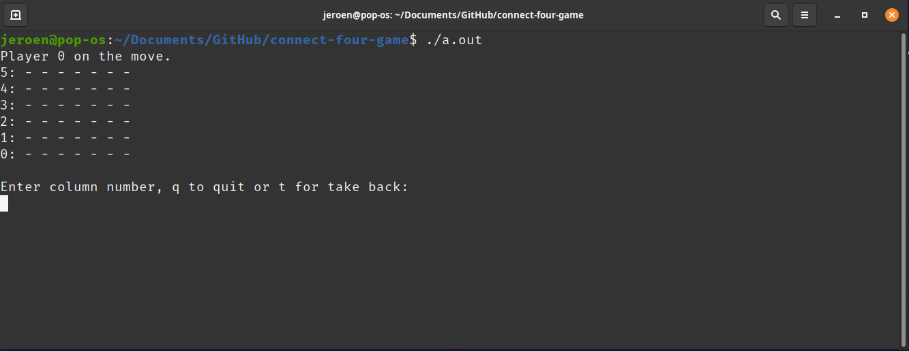

# Play connect-four-game against the computer

This project is a [backtracking](https://www.geeksforgeeks.org/backtracking-algorithms/) demo of the game [Connect Four](https://en.wikipedia.org/wiki/Connect_Four).

## Playing the game. 

 
The game itself starts the human player to enter a number from 0 to 6. This is the column in which the coin will be entered. The computer will calculate its move and shows the playfield again. This repeats until the game is finished. 

## Implementation

The backtracking algorithm is using its own stack implementation. Just for fun, it is not using the system stack. Backtracking requires a score calculation. In this demo, the score is calculated by potential winning entries.

Uncommnent `/* #define PRINT_TREE */` to see the full evaluation tree.
